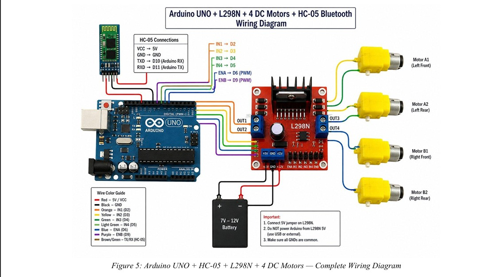

# Wireless-Embedded-RC-Car

A Bluetooth-controlled embedded RC car built using Arduino Uno, HC-05 Bluetooth module, and L298N motor driver. The project demonstrates wireless communication, embedded motor control, PWM-based speed regulation, and real-time directional movement control.

---

# Features

- Wireless Bluetooth control
- Forward, backward, left, right, and stop movement
- PWM motor speed control
- Real-time command transmission
- Arduino-based embedded system
- L298N H-Bridge motor driving

---

# Hardware Components

- Arduino Uno
- HC-05 Bluetooth Module
- L298N Motor Driver
- 4 DC Gear Motors
- RC Car Chassis
- Battery Pack
- Jumper Wires
- Smartphone with Bluetooth RC Controller App

---

# Pin Connections

| Module | Arduino Pin |
|---|---|
| HC-05 TXD | D10 |
| HC-05 RXD | D11 |
| L298N IN1 | D2 |
| L298N IN2 | D3 |
| L298N IN3 | D4 |
| L298N IN4 | D5 |
| L298N ENA | D6 (PWM) |
| L298N ENB | D9 (PWM) |

---

# Working Principle

The smartphone sends Bluetooth commands through the HC-05 module. Arduino Uno receives the commands using SoftwareSerial communication and controls the L298N motor driver to move the RC car in different directions.

## Commands Used

- `F` → Forward
- `B` → Backward
- `L` → Left
- `R` → Right
- `S` → Stop

---

# Technologies Used

- Embedded Systems
- Arduino Programming
- Bluetooth Communication
- PWM Motor Control
- Serial Communication

---

# Circuit Diagram



---

# Arduino Code

Arduino source code is available in:

```bash
code/code.ino
```

---

# Applications

- Robotics projects
- Wireless vehicle control
- Embedded systems learning
- Communication system demonstrations
- Educational RC platforms

---

# Future Improvements

- Obstacle avoidance using ultrasonic sensors
- ESP32 camera integration
- IoT-based remote control
- GPS navigation
- Mobile app development

---
# Wireless-Embedded-RC-Car

A Bluetooth-controlled embedded RC car built using Arduino Uno, HC-05 Bluetooth module, and L298N motor driver. The project demonstrates wireless communication, embedded motor control, PWM-based speed regulation, and real-time directional movement control.

---

# Project Preview

image/Rc visual1.jpeg
---

# Features
# Author

**Ritheshwaran A**  
B.E Electronics and Communication Engineering  
College of Engineering Guindy, Anna University
